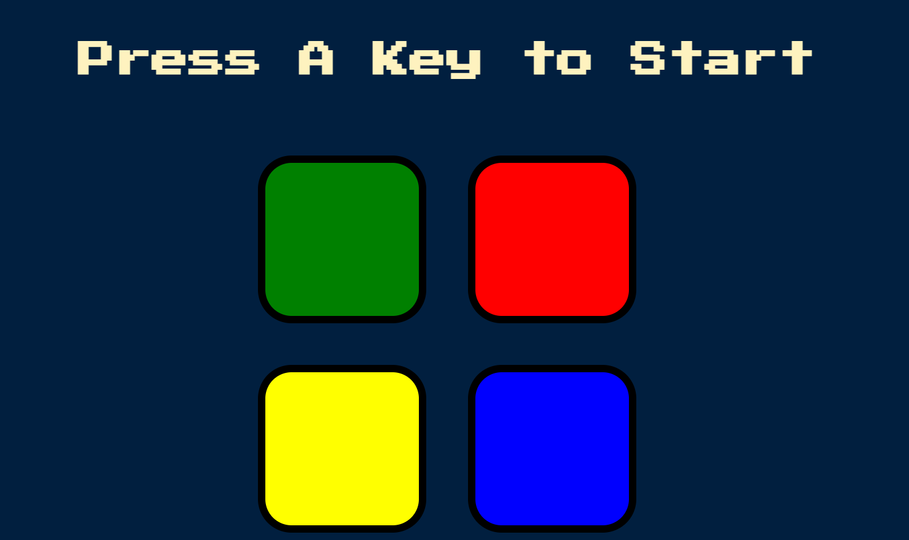

# 🎮 Simon Game

A browser-based implementation of the classic **Simon memory game**, built using **HTML, CSS, and JavaScript**.  
This project tests and improves pattern recognition skills through interactive gameplay, sounds, and progressive difficulty.

🔗 **Live Demo:** https://ay001-web.github.io/Simon-Game/

---

## 📌 Overview

The Simon Game is a memory-based game where players must repeat an increasingly long sequence of colors and sounds.  
Each correct round adds a new step to the pattern, making the game more challenging as it progresses.

This project demonstrates strong fundamentals of **frontend development**, including DOM manipulation, event handling, and user interaction.

---

## 🚀 Features

-  Interactive and responsive UI.  
-  Sound effects for each button. 
-  Progressive difficulty with level tracking.  
-  Keyboard-based game start.  
-  Game-over feedback with reset functionality.  

---

## 🛠️ Tech Stack

- **HTML5** – Structure of the game  
- **CSS3** – Styling and layout  
- **JavaScript (Vanilla)** – Game logic, DOM manipulation, and event handling  

---

## 📂 Project Structure

```text
Simon-Game/
│── index.html
│── styles.css
│── game.js
│── sounds/
│   ├── red.mp3
│   ├── blue.mp3
│   ├── green.mp3
│   ├── yellow.mp3
│   └── wrong.mp3
│── README.md
│── LICENSE
```

## ▶️ How to Play

1. Press any key to start the game.  
2. Watch the sequence of colors carefully.  
3. Repeat the sequence by clicking the buttons in the correct order.  
4. Each level adds a new color to the sequence. 
5. A wrong move ends the game and resets the level.
---

## 💻 Run Locally

To run this project on your local machine:

```bash
git clone https://github.com/ay001-web/Simon-Game.git
cd Simon-Game
```

## 📸 Preview


---

## 🎯 Learning Outcomes

- Improved understanding of JavaScript logic and control flow.  
- Hands-on experience with DOM manipulation.  
- Better grasp of event-driven programming.  
- Practical exposure to Git and GitHub workflow.  
- Experience deploying projects using GitHub Pages.
 ---

## 📄 License

This project is licensed under the **MIT License**.  
You are free to use, modify, and distribute this project for learning purposes.
---


## 🙌 Acknowledgements

Inspired by the classic **Simon electronic memory game**.  
Built as part of frontend development practice and portfolio projects.
---

⭐ If you liked this project, consider starring the repository to support my work.


